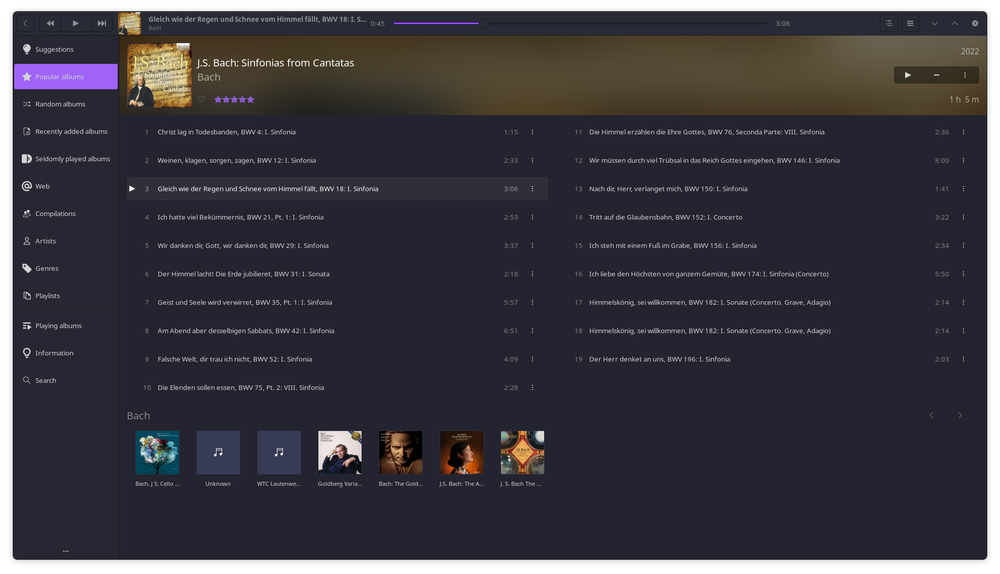

# Scarlatti: A modern, powerful music player for Linux



Scarlatti is a mostly-backwards-compatible fork of Lollypop, the GNOME music playing application.
Scarlatti was created because I needed a number of new features in my Lollypop workflow, and no
other music player met my needs.

Scarlatti is designed to be particularly good at searching through large collections of untagged
music with detailed filenames (which is a large part of my unusual workflow)

Generally speaking, Scarlatti will accept any reasonable feature request so as to make it useful for
the largest number of people. Not all features will be enabled by default, but Scarlatti's philosophy
is that a good music player should be powerful and extremely flexible while still having a modern
look and feel.

This project would not have been possible without the work of the original Lollypop developers,
particularly Cédric Bellegarde. Please consider supporting him and Lollypop by going to
https://www.patreon.com/gnumdk

Scarlatti provides, among other features:

- MP3/4, Ogg and FLAC support
- Genre/artist/cover browsing
- Regex search with word-grouping
- Search synonym/typo-correction system
- Queue
- Party mode
- ReplayGain
- Cover art downloader
- Artist view
- MTP sync
- Fullscreen support
- Last.fm support
- HiDPI support
- TuneIn support
- Builtin codecs

For a full list of improvements to Lollypop, see [here](./scarlatti-vs-lollypop.md).

For a (heavy WIP) usage guide, see [here](./how-do-I.md).

For a list of build dependencies, see [here](./build-dependencies.md).

## Flatpak installation (recommended)
``` bash
bash -c "$(curl -L https://github.com/krischerven/scarlatti/raw/master/install-flatpak.sh)"
```

## Building from source

```bash
git clone https://github.com/krischerven/scarlatti
cd scarlatti
meson builddir --prefix=/usr/local
# sudo ninja -C builddir install
```

### Building on Debian/Ubuntu

```bash
git clone https://github.com/krischerven/scarlatti
cd scarlatti
# sudo apt-get install --ignore-missing meson libglib2.0-dev yelp-tools libgirepository1.0-dev libgtk-3-dev gir1.2-totemplparser-1.0 python-gi-dev
meson builddir --prefix=/usr/local
# sudo ninja -C builddir install
```

### Building on Fedora

```bash
git clone https://github.com/krischerven/scarlatti
cd scarlatti
# sudo dnf install --skip-broken meson glib2-devel yelp-tools gtk3-devel gobject-introspection-devel python3 pygobject3-devel python3-gobject-devel libsoup3-devel totem-pl-parser libhandy python3-pillow
meson builddir --prefix=/usr/local
# sudo ninja -C builddir install
```

<!-- [](https://repology.org/project/lollypop/versions) -->
    